# Memory Grid

A Spectacles AR memory game built with Lens Studio. Players memorize a path shown on a virtual grid, then walk the correct route by stepping on tiles in the correct order.

## Quick Start

1. **Clone this repository**
2. **Open in Lens Studio** — Open `memory-grid.esproj` in Lens Studio (v5.15 or compatible)
3. **Preview or Publish** — Use Spectacles Preview or publish to Lens Explorer for Spectacles

The project includes all required packages (Surface Placement, Spectacles Interaction Kit, Spectacles UI Kit, etc.) and is ready to run.

## Overview

This game uses **Device Tracking (World Mode)** to track the player's position in real-world space and map it onto a virtual 5×5 grid placed on the floor. The core mechanic relies on detecting when the player steps on specific grid tiles.

### Features

- **11 levels** — Path length increases from 5 to 25 tiles
- **Achievements system** — Unlock badges as you progress
- **Robot host** — Voice-guided instructions and feedback
- **FOV-optimized** — Progressive reveal, start-anchored grid, designed for Spectacles' limited field of view

### Technical Documentation

This project implements a **collider-based vertical activation system** for reliable **grid-based** tile detection in walking-based Spectacles games—replacing error-prone position/distance checks with physics-based overlap detection. Purpose-built for structured tile grids (not open-world or sparse zones). For details on the problem, solution, scope, and how to reuse the pattern:

**[docs/COLLIDER_BASED_ACTIVATION.md](docs/COLLIDER_BASED_ACTIVATION.md)**

### FOV-Optimized Design

The game is designed around Spectacles' limited field of view:
- **Progressive reveal** — path appears tile-by-tile, guiding attention
- **Focal point first** — yellow start tile appears immediately after placement
- **Start-anchored grid** — place the tracker where you want to START, grid extends away from you

## Project Structure

```
Scripts/
├── Core/
│   ├── GameStateManager.js   # Component: Main game orchestrator
│   └── PlacementBridge.js    # Component: Bridges Surface Placement package
│
├── Grid/
│   ├── GridManager.js        # Component: Grid creation and tile management
│   └── PathGenerator.js      # Module: Random path generation algorithms
│
├── Host/
│   └── HostManager.js        # Component: Robot host with billboard behavior
│
├── Player/
│   └── PlayerTracker.js      # Component: Position tracking and validation
│
├── UI/
│   ├── AchievementNotification.js # Component: Manual-position popup for achievement unlocks
│   ├── AchievementsUI.js     # Component: Achievements screen with card grid
│   ├── CountdownDisplay.js   # Component: 3-2-1 countdown on floor
│   ├── LookDownHint.js       # Component: Hint text parented to camera after floor placement
│   ├── MainMenuManager.js    # Component: Main menu with Start/Achievements buttons
│   ├── PalmExitButton.js     # Component: Exit button (place under wrist in scene; show/hide by game state)
│   ├── StartZoneVisual.js    # Component: Start zone marker with collision detection
│   └── StartZoneParticles.js # Component: Rising particle effect for start zone
│
└── Utils/
    ├── AnimationManager.js   # Module: LSTween-based animation helpers
    ├── AudioManager.js       # Component: Voice line audio playback (auto-matches by filename)
    ├── Constants.js          # Module: Game configuration and constants
    ├── DialogueLines.js      # Module: Host dialogue text and audio IDs
    ├── MathHelpers.js       # Module: Math utilities for calculations
    └── SaveManager.js        # Module: Persistent storage for progress/achievements
```

### Script Types

**Component Scripts** (attached to SceneObjects):
- Use `@input` decorators for Inspector inputs
- Export via `script.functionName = functionName`

**Module Scripts** (imported via require):
- Use `module.exports` for exports
- Imported with `require("./path/to/module")`

## Setup Instructions (for modification or rebuild)

The project is pre-configured—open the `.esproj` file to run. The following steps are for understanding the architecture or building from scratch:

### 1. Scene Setup

1. Create a new Lens Studio project for Spectacles
2. Add **Device Tracking** component to the Camera:
   - Select Camera in Scene Hierarchy
   - Add Component → Device Tracking
   - Set Tracking Mode to **World**
3. Import the **Surface Placement** package from the Asset Library

### 2. Surface Placement Integration

1. **Add the Surface Placement prefab** to your scene
2. **Create your game hierarchy under objectVisuals:**
   ```
   SurfacePlacement (from package)
   └── ObjectVisuals
       └── GridParent           # Parent for all grid tiles (required)
   ```
   
   Optional objects (add as needed):
   - `CountdownText` - Text component for 3-2-1 countdown
   - `HostPlaceholder` - Empty object for robot host
   - `SubtitleText` - Text for host dialogue

3. **Attach PlacementBridge.js** to the `ObjectVisuals` object

**Placement flow (Start → Game):**

```mermaid
flowchart TD
    A[User taps Start] --> B[Main menu hides]
    B --> C[Surface Placement prefab enabled]
    C --> D[User pinch-places grid on floor]
    D --> E[PlacementBridge detects objectVisuals enabled]
    E --> F[PlacementBridge.onGridPlaced]
    F --> G[GameStateManager.onGridPlaced]
    G --> H[GridManager.initialize + PlayerTracker.init]
    H --> I[GRID_INTRO state]
    I --> J[Host intro → COUNTDOWN → ...]
```



### 3. Script Setup

Create empty SceneObjects and attach scripts:

| SceneObject | Script | Key Inputs |
|-------------|--------|------------|
| MainMenu | `UI/MainMenuManager.js` | InterfaceContainer, MenuContainer, AchievementsContainer, StartButton, AchievementsButton, ResetProgressButton, ResetAllButton (optional, debug), LevelText, FloorPlacementPrefab OR FloorPlacementObject, FloorPlacementParent, AchievementsUI |
| SaveManager | `Utils/SaveManager.js` | *(none - just attach to any SceneObject)* |
| AudioManager | `Utils/AudioManager.js` | VoiceLines[] (all audio files), AudioPlayer |
| AchievementNotification | `UI/AchievementNotification.js` | NotificationRoot, TitleLabelObject, DescriptionLabelObject, IconObject, IconTextures[] (optional if AchievementsUI has icons), NotificationAudio, IconTextureProperty, DisplayDuration |
| AchievementsUI | `UI/AchievementsUI.js` | BackButton, CardPrefab, GridContainer, IconTextures[] (all PNGs), LockedTint, MainMenuScript |
| PalmExitButton | `UI/PalmExitButton.js` | ExitButton (or ExitButtonContainer as alias) |
| LookDownHint | `UI/LookDownHint.js` | Camera, HintContainer, HintText |
| ObjectVisuals* | `Core/PlacementBridge.js` | GameStateManager |
| GridManager | `Grid/GridManager.js` | GridParent, TilePrefab, TriggerPrefab, ScaleTiles |
| PlayerTracker | `Player/PlayerTracker.js` | Camera, GridManager, AudioPlayer, StepTracks[25], CompletionTrack, ErrorTrack, CountdownTrack, WatchTrack |
| GameStateManager | `Core/GameStateManager.js` | GridManager, PlayerTracker, HostManager (optional), StartZoneVisual (optional), CountdownDisplay (optional), ConfettiVFX (optional) |
| HostManager | `Host/HostManager.js` | HostObject, Camera, SubtitleText (optional), ForwardDistance, HeightOffset, LateralOffset, FollowEasing |
| StartZoneVisual | `UI/StartZoneVisual.js` | StartZonePlane, ZoneCollider (required), ParticlesScript (optional) |
| StartZoneParticles | `UI/StartZoneParticles.js` | ParticlePrefab, SpawnRate, RiseSpeed, Lifetime, StartScale |
| CountdownDisplay | `UI/CountdownDisplay.js` | CountdownText3D, TextParent |

*ObjectVisuals is from the Surface Placement package

### 4. Tile Prefab

Create a tile prefab with:
- A box mesh (RenderMeshVisual)
- Material with `baseColor` property for color changes
- Base size: 1 unit (script scales to `TILE_SIZE` from `Constants.js`, default 50cm, if `scaleTiles` is enabled)
- Add an **"Arrow"** child object for direction hints

### 5. Arrow Setup

Add an arrow as a child of your tile prefab:

1. Add a child object named **"Arrow"**
2. Add a plane mesh with an arrow texture
3. Rotate flat on the tile (X = -90°)
4. The script automatically rotates arrows to point toward the next tile

### 6. Trigger Prefab Setup

The game uses collision-based detection for reliable tile entry. This filters out head tilts and only detects actual walking.

1. **Create a Trigger Prefab:**
   - Create a new SceneObject with a **Physics.ColliderComponent** (Box shape)
   - Set the collider as a **Trigger** (not solid)
   - Shape it as a vertical plane (e.g., 40cm wide x 60cm tall x 5cm deep)
   - Attach `Grid/TileTrigger.js` script to it
   - Save as a prefab

2. **Add a Collider to Camera:**
   - Add a **Physics.ColliderComponent** to your camera object
   - Use a small sphere or box shape (e.g., 10cm)
   - Set body type to **Dynamic** or **Kinematic**

3. **Assign in GridManager:**
   - Drag your trigger prefab to the **Trigger Prefab** input

**How it works:**

```mermaid
flowchart TD
    A[Grid created] --> B[Trigger plane at each tile center]
    B --> C{Player walks forward}
    C --> D[Camera collider passes through trigger]
    D --> E[onOverlapEnter fires]
    E --> F[TileTrigger → PlayerTracker validates]
    C -->|Head tilt only| G[Collider doesn't move enough]
    G --> H[No trigger - avoids false positives]
```



- Trigger planes are spawned at each tile center when the grid is created
- When you walk forward, your camera collider passes through the trigger
- Head tilts don't trigger because rotation doesn't move the collider forward enough

### 7. Start Zone Collider Setup (Required)

1. **Add a Collider to Start Zone:**
   - Add a **Physics.ColliderComponent** to your start zone object
   - Use a Box shape sized to match your start zone visual (e.g., 50cm x 50cm x 60cm tall)
   - Set the collider as a **Trigger** (not solid)

2. **Assign in StartZoneVisual:**
   - Drag the collider to the **Zone Collider** input on StartZoneVisual script

## Game Flow


| State | Description |
|-------|-------------|
| **IDLE** | Main menu visible |
| **PLACING_GRID** | User places grid on floor using pinch gesture |
| **GRID_INTRO** | Dimmed grid with bright yellow START tile; Level 1: Welcome → Goal → Level 1; Level 2+: level announcement only |
| **COUNTDOWN** | 3-2-1-WATCH on floor |
| **MEMORIZE** | Path revealed tile-by-tile (~0.5s each), arrows on each |
| **PLAYING** | Path hidden, player walks from memory; idle prompt after 15s |
| **COMPLETED** | Success audio, confetti, "Head back to start zone!" |
| **FAILED** | Fail audio, reveal path, "Step back to start zone!" |
| **WAITING_IN_START_ZONE** | Start zone marker appears; player enters → level announcement → COUNTDOWN |

### Step Validation Flow

When the player walks onto a tile, the collider-based trigger fires and `PlayerTracker` validates the step:


### Why Progressive Reveal?

Spectacles' limited FOV makes scanning a full grid difficult. Instead:


1. Player's attention starts on the yellow start tile (focal point)
2. Tiles appear sequentially (~0.5s each), naturally guiding the eye
3. Arrows show direction without needing to see the whole grid
4. The path "draws itself" from player's perspective

## Visual Guide

### Initial State (after placement)
- ⬜ **White (dim)** = All tiles at 15% opacity (background)
- 🟨 **Yellow (bright)** = Start tile at ~77% opacity (focal point)

### During COUNTDOWN
- Start tile stays highlighted as the focal point (no arrows yet)

### During MEMORIZE (progressive reveal)
- 🟨 **Yellow** = Start tile (with arrow)
- 🟩 **Green** = Path tiles revealed one-by-one (with arrows)
- 🟦 **Blue** = End tile (no arrow, revealed last)

### During PLAYING
- 🟨 **Yellow** = Start tile (stays visible)
- ⬜ **White** = All other tiles at ~50% opacity with a subtle idle alpha pulse
- 🟦 **Blue** = End tile (stays visible)
- 🟩 **Green** = Tiles turn green when stepped on correctly

## Configuration

Edit `Assets/Scripts/Utils/Constants.js` to customize:

### Debug Settings
```javascript
var DebugConfig = {
    ENABLED: true,           // Enable on-screen debug logging via TextLogger
    SKIP_PATH_CHECK: false,  // Skip path validation — step on end tile to instantly win
};
```

### Grid Settings
```javascript
var GridConfig = {
    DEFAULT_ROWS: 5,
    DEFAULT_COLUMNS: 5,
    TILE_SIZE: 50,           // 50cm tiles
    TILE_GAP: 5,             // 5cm gap between tiles
    DEFAULT_ALPHA: 0.5,      // Default white tile opacity
    VISIBLE_ALPHA: 0.77,     // Opacity for highlighted tiles
    DIMMED_ALPHA: 0.15,      // Background tile opacity
    IDLE_PULSE_ENABLED: true,
    IDLE_PULSE_ALL_TILES: true,
    IDLE_PULSE_SPEED: 0.35,
    IDLE_PULSE_MIN_ALPHA: 0.3,
    IDLE_PULSE_MAX_ALPHA: 0.8,
};
```

### Level Progression

Path length formula: `BASE_PATH_LENGTH + (level - 1) * PATH_INCREMENT`
- Level 1: 5 tiles
- Level 2: 7 tiles
- Level 3: 9 tiles
- Level 11: 25 tiles (max)

## Host Dialogue

The robot host uses pre-defined dialogue lines in `Utils/DialogueLines.js`. Audio plays via `AudioManager` when voice files are imported; falls back to timer-based progression otherwise.

### Adding Voice Audio

1. **Generate audio files** using ElevenLabs or similar TTS service (use `voice_lines.json` as input)
2. **Import audio files** into Lens Studio
3. **Set up AudioManager** — attach script, add voice files to Voice Lines array
4. Name files to match dialogue IDs exactly (e.g., `welcome.mp3`, `level_1.mp3`)

## Core Components


| Component | Role |
|-----------|------|
| **GameStateManager** | Orchestrates game flow, exposes `global.PathFinder.Game`, `global.PathFinder.Placement`, `global.PathFinder.MainMenu` |
| **GridManager** | Grid creation, path generation, tile visualization |
| **PlayerTracker** | Collision-based step validation, start zone detection |
| **HostManager** | Robot host with billboard behavior, dialogue playback |
| **SaveManager** | Persistent storage via `global.PathFinder.Save` |

See `Assets/Scripts/Core/`, `Assets/Scripts/Grid/`, `Assets/Scripts/Player/`, `Assets/Scripts/Host/`, and `Assets/Scripts/Utils/` for full API details.

## Troubleshooting

**Grid not visible:** Check tile prefab, verify GridParent is under ObjectVisuals, grid anchors from placement point.

**Start tile not appearing bright:** Verify path is generated, check dimGridBackground and showOnlyStartTile are called.

**Host not appearing:** Verify HostPlaceholder exists, check camera reference. Host is optional.

**Arrows not showing:** Ensure tile prefab has child named "Arrow", flat on tile (X rotation = -90°).

**Position not tracking:** Verify Device Tracking is World mode, check camera reference in PlayerTracker.

**Tiles trigger too early:** Keep only one collider on camera for movement; tile triggers ignore non-Camera colliders.

**Grid too big for FOV:** Reduce TILE_SIZE in Constants.js (default 50cm).

**Countdown not starting:** Zone state resets between rounds; step out and back into start zone to re-trigger.

**Achievement notification sound but no popup:** Ensure NotificationRoot points to the popup object; check it's not under a disabled parent.

### 8. Exit Button Setup

The exit button returns to the main menu during gameplay. **Place the exit button directly under the right wrist** in the Lens Studio hierarchy—this works well on Spectacles. The script shows/hides the button; it binds via SIK `onTriggerEnd` or UIKit `onTriggerUp`.

1. Create your exit button (e.g., Spectacles UI Kit button)
2. Parent it under the **Right Wrist** object from Hand Tracking
3. Attach `PalmExitButton.js` to a SceneObject and assign the button to **Exit Button**
4. The button appears when the game starts (after floor placement) and hides when exiting to menu

## Requirements

- [Lens Studio](https://ar.snap.com/lens-studio) (Spectacles target)
- Spectacles device (recommended for testing)

Feel free to [fork](https://docs.github.com/en/get-started/quickstart/fork-a-repo) this project to use, modify, or build upon it.

## License

MIT License — see [LICENSE](LICENSE) for details.
